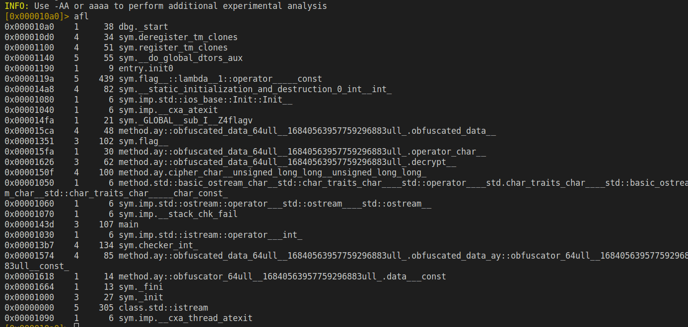
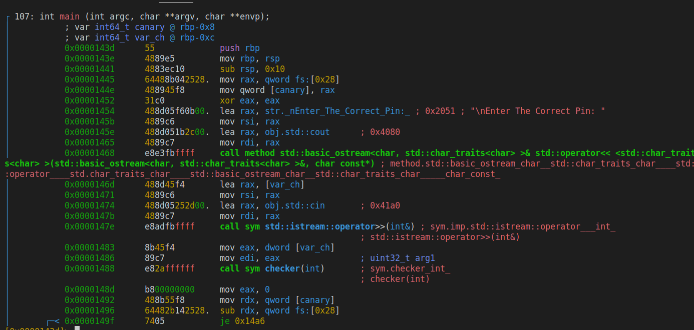
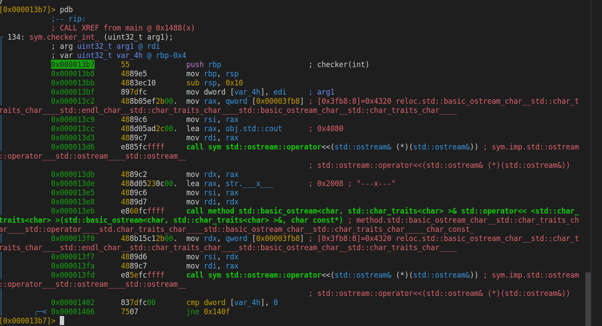
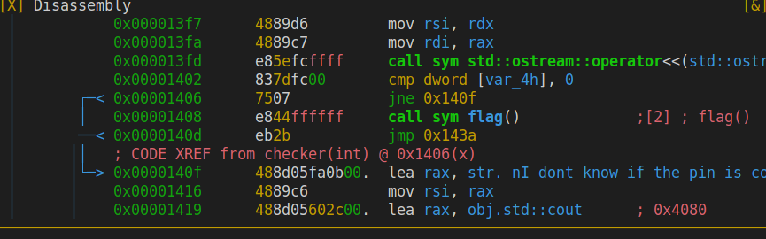
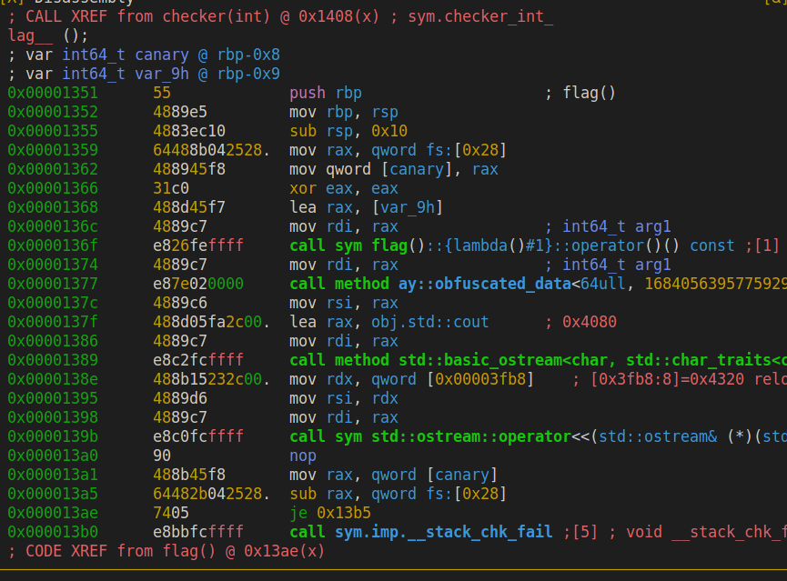

<h4 dir="rtl" style="text-align:center">بسم الله الرحمن الرحيم</h4>

# illogical_logic 
url : [crackmes.one](https://crackmes.one/crackme/637c66b633c5d43ab4ecec2a)\
author : [marufmurtuza](https://crackmes.one/user/marufmurtuza)
### What I'v learned:
- There are many ways for a developer to make reverse enginnering painfull!
- using `cin` function to integer while entering anything other than a number will make the stored value default to 0(in case of signal character)
- `strings` command does not always give the password :rofl:

### How to crack:
- use r2 to disassemble the binaries.
- `aaa` command to analyze the binary.
- `afl` command to list functions.

  - functions that has obfuscated keyword are just used to cipher and obfuscate the flag. I think.
  - there are 2 functions that are interesting checker and flag.
- Lets start by disassembling the main function.
  - `s sym.main` command to seek for main
  - `pdb` command to display disassembly of main.

    -first couple lines are for functions (prologue)[https://en.wikipedia.org/wiki/Function_prologue_and_epilogue]
    - next we see the call to `cout` function.
    - `lea rax, [var_ch]` load effective address of var_ch(local integer variable) to `rax` register.
    - next three lines are for accepting user supplied pin.
    - ` e8adfbffff     call sym std::istream::operator>>(int&) ; sym.imp.std::istream::operator___int_
│                                                                      ; std::istream::operator>>(int&)`
    - note that `>>` operator is redirecting input to an `int` which will store the input in `var_ch` 
    - `mov eax, dword [var_ch]`
    - `mov edi, eax  `
    - `call sym checker(int)` : call checker function and passing the argument in `edi` register.
- lets disassemble checker function

  - ignore most of it and focus on the compare instruction. `cmp dword [var_4h], 0` it compare the passed argument (which is the user supplied pin) with 0. if its not equal to 0 it will jump to the end of the function but if its equal it will not jump and call `flag` function.

- lets disassemble flag functions.

  - most of the assembly is calling functions which will print the flag that is ciphered.
- back to the checker function. so the pin must be zero to print the flag? Yes and no, yes you need 0 and no you can enter any single character which will display the flag also, why ?? because `cin` redirect the user entered value to an integer so if it incounter a character it will store 0 in the variable.

# NEXT
-----
<h4 dir="rtl" style="text-align:center"> الحمدلله رب العالمين</h4>

-----